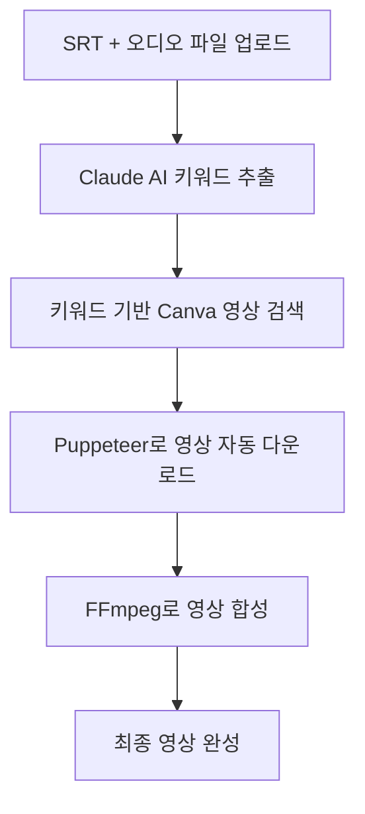

# Smart Video Editor 코드 분석 보고서

## 프로젝트 개요
- **프로젝트명**: Smart Video Editor
- **버전**: 1.0.0
- **설명**: Canva 통합을 통한 AI 기반 스마트 영상 편집기
- **주요 기능**: SRT 자막 파일과 오디오 파일만 업로드하면 자동으로 영상을 생성

## 기술 스택

### 프론트엔드
- **Next.js**: React 기반 웹 프레임워크
- **React 18**: 사용자 인터페이스 라이브러리
- **Framer Motion**: 애니메이션 라이브러리
- **Radix UI**: 접근성 우선 UI 컴포넌트
- **Lucide React**: 아이콘 라이브러리
- **Redux Toolkit**: 상태 관리

### 백엔드 & 데스크톱
- **Electron**: 크로스 플랫폼 데스크톱 앱 프레임워크
- **Node.js**: 서버 사이드 JavaScript 런타임

### AI & 자동화
- **Anthropic Claude API**: AI 키워드 추출 및 분석
- **Puppeteer**: 브라우저 자동화 (Canva 스크래핑)
- **Puppeteer Extra**: Stealth 모드 및 확장 기능

### 미디어 처리
- **FFmpeg**: 영상 처리 및 렌더링
- **Sharp**: 이미지 처리

### 기타
- **Axios**: HTTP 클라이언트
- **Electron Store**: 설정 저장
- **React Hot Toast**: 알림 시스템

## 아키텍처 구조

### Electron 메인 프로세스
```
electron/
├── main.js          # 앱 초기화, 창 관리
├── preload.js       # 렌더러 프로세스와의 안전한 통신
└── service/
    ├── canvaService.js    # Canva 자동화 서비스
    ├── claudeService.js   # Claude AI 서비스
    ├── videoService.js    # 영상 관리 서비스
    └── ffmpegService.js   # FFmpeg 영상 처리
```

### 프론트엔드 (Next.js)
```
out/                 # 정적 빌드 결과물
├── index.html       # 메인 페이지
├── _next/          # Next.js 번들 파일들
└── static/         # 정적 자원들
```

## 핵심 기능

### 1. AI 키워드 추출
- **서비스**: `claudeService.js`
- **기능**: SRT 자막 파일에서 Claude AI를 사용해 키워드 추출
- **특징**:
  - 토큰 제한을 고려한 배치 처리 (15k 토큰 제한)
  - 한국어 텍스트 최적화된 토큰 계산
  - 80개 이상 자막 시 강제 다중 배치 처리

### 2. Canva 자동화
- **서비스**: `canvaService.js`
- **기능**: Puppeteer를 사용해 Canva에서 영상 자동 다운로드
- **특징**:
  - Stealth 플러그인으로 감지 회피
  - 강력한 중복 방지 시스템 (ID, URL, 파일, 제목 해시)
  - Chrome 프로필 관리
  - 메타데이터 추적

### 3. 영상 렌더링
- **서비스**: `ffmpegService.js`
- **기능**: FFmpeg를 사용한 최종 영상 합성
- **처리 과정**: 자막 + 오디오 + 영상 소스 → 완성된 영상

### 4. 프로젝트 관리
- **기능**: SRT 및 오디오 파일 업로드 및 관리
- **UI**: 다크 테마의 직관적인 인터페이스
- **모드**: 자동/수동 모드 지원

## UI/UX 특징

### 디자인
- **테마**: 다크 테마 (zinc 색상 팔레트)
- **레이아웃**: 사이드바 + 메인 콘텐츠 영역
- **아이콘**: Lucide React 아이콘 시스템
- **애니메이션**: Framer Motion 기반 부드러운 전환

### 네비게이션
- 프로젝트 관리
- 키워드 추출
- 비디오 관리
- 렌더링
- 설정

### 상태 표시
- Canva 연결 상태
- FFmpeg 설치 상태
- 실시간 진행 상황

## 워크플로



## 보안 및 최적화 특징

### 보안
- **Context Isolation**: Electron 보안 설정
- **Stealth Mode**: Puppeteer 감지 회피
- **API Key 관리**: 안전한 Claude API 키 저장

### 성능 최적화
- **중복 방지**: 다중 해시 기반 중복 다운로드 방지
- **배치 처리**: AI API 호출 최적화
- **메타데이터 캐싱**: 다운로드 이력 추적

### 다국어 지원
- **한국어 우선**: 완전한 한국어 UI
- **UTF-8 환경**: Windows 한글 콘솔 출력 최적화

## 기술적 특이사항

1. **프레임리스 창**: 커스텀 타이틀바 구현
2. **정적 빌드**: Next.js export를 통한 Electron 최적화
3. **서비스 아키텍처**: 모듈화된 백엔드 서비스
4. **실시간 상태 관리**: Redux + IPC 통신
5. **에러 처리**: 강력한 예외 처리 및 복구 메커니즘

## 대상 사용자
- 콘텐츠 크리에이터
- 영상 편집자
- 자막 기반 영상 제작자
- 자동화된 워크플로를 원하는 사용자

## 경쟁 우위
- **완전 자동화**: 최소한의 사용자 개입으로 영상 제작
- **AI 통합**: 지능형 키워드 추출 및 매칭
- **Canva 연동**: 풍부한 영상 소스 활용
- **한국어 최적화**: 국내 사용자 맞춤형 기능

이 프로젝트는 AI와 자동화를 활용해 영상 제작 과정을 혁신적으로 간소화한 정교한 데스크톱 애플리케이션입니다.